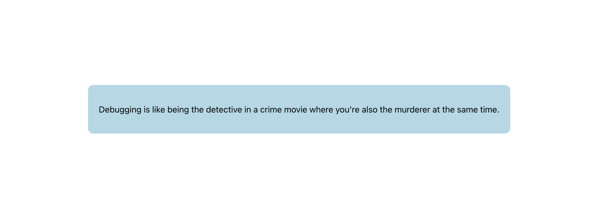
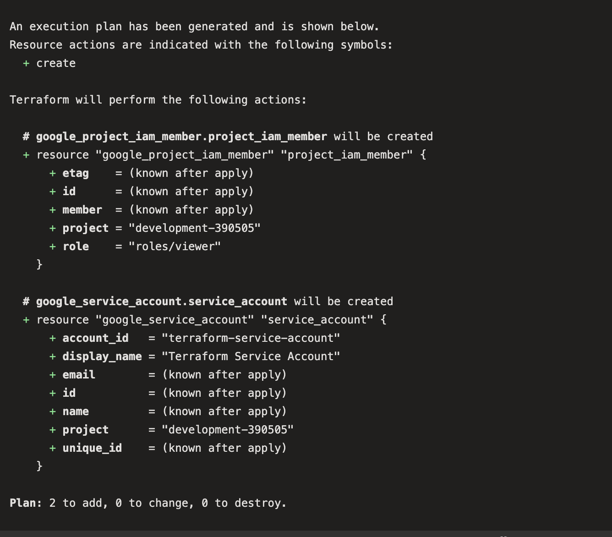
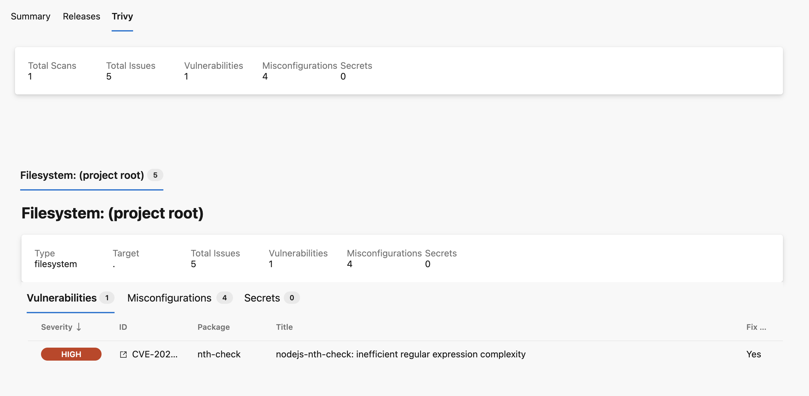

# Jokes Demo

An application to serve random jokes



## Description

This application is built using a React frontend and a Springboot backend. This project largely focuses on the DevOps tooling and principles surrounding the app.

The DevOps tooling includes:

- Azure pipelines
- GCP Cloud Run
- Azure Repository
- Google Container Registr (gcr.io)
- Terraform
- Docker
- Gradle & NPM

## Getting Started

### Dependencies

- Docker engine
- Gradle, JDK, NPM

### Installing

- Git clone the repo down
- Install gradle, JDK, and npm (using brew most likely)
- Install the docker engine to containerize the application

### Executing program manually

To run the application locally, git clone the [repository](https://dev.azure.com/roeelandesman/_git/jokes-demo) first.
Then, in shell #1:

```shell
cd cd jokes-backend
./gradlew bootRun
```

In shell #2:

```shell
curl http://localhost:3000/joke
```

You should see a random joke printed to the console!

In shell #3:

```shell
cd jokes-frontend
npm start
```

You should now see the full application launch on localhost

### Executing using Docker

To run using a single Docker container, `cd` into the root directory and run the following commands.
The first will build the app and tag it as `my-app`, while the second runs it,
exposing port 3000 on your local machine to forward into the container's port 3000.

```shell
docker build -t my-app .
docker run -p 3000:3000 my-app
```

You should now be able to curl `localhost:8080` and see the app running!

### Remote Cloud Run URL

The pipelines described below ultimately publish the container to both a Production and Development environments in GCP.

The prod url is: <https://jokesdemo-3qt2ph54na-uc.a.run.app>
The development url is: <https://jokesdemo-srcz2fon7a-uc.a.run.app>

## Automation

### CI/CD

The automation in Azure pipelines is split into two function: build and deploy. In Azure language this is mapped to
`pipeline` and `release`, respectivly.

The build pipeline runs on every merge to `main`. It builds scans, builds, and ships the container image to GCR, and is
defined in the `.azure-pipelines.yml` file. An interesting caveat here is that in building this workflow I wasa using the self-hosted
MacOS agent on my apple-silicon laptop, however the final container runs on linux/amd64, which requires a cross-platform build
using buildx.

The release pipeline is triggered by the creation of a new release artifact (i.e the previous build pipeline). It deploys to the `Development`
project in GCP automatically, which auto-updates the Cloud Run application with the latest container build. Then, upon user-approval, the pipeline
will deploy the same container image -- which is safer than rebuilding since we can trust the image -- to `Production`.

To productionize these pipelines I would add monitoring and alerting on success/failure rates, include failback options for resiliance,
increase customizability from the developer's perspective, and look into cloud-hosted solutions (the self-hosted one was very flakey).

### Terraform

As an example of how I would manage cloud resources in Infrastructure as Code (IaC) I have included a mock terraform resource
that will initialize and plan the creation of a serviceaccount (see image below). In additon, I've created an automated pipeline
that will run on every push to a branch, ensuring minimal drift between terraform state and what is live in GCP. This is essential
for scalability in an organization as it provides ensured security, standardization, growth, and speed of procurement.

For the purposes of this demo I used a static serviceaccount token and stored it in the Azure pipeline, however in production
I would write the neccessary code to authenticate the azure pipeline against GCP using OIDC, thus transitioning to short-lived
dynamically-created tokens.



## Security

The Azure repository has several security features enabled, mocking a real production-like environment

- I have created a PAT to authenticate Azure Pipelines running locally against the cloud. This token expires in 30 days, is stored locally in a 1password vault, and has scoped permissions for Agent Pools management only.
- Vulnerability scanning in GCR and in the build pipeline using Trivy
  - This would in the future be linked to slack notifications and/or automated JIRA ticket creation to help promote security best-practices
  - More security tooling such as [git-secrets](https://github.com/awslabs/git-secrets) and [rootfs](https://aquasecurity.github.io/trivy/v0.27.1/docs/vulnerability/scanning/rootfs/) scanning would be introduced here
- All pull requests require an approval from a project owner (to unblock myself I've allowed myself to approve PRs), and no commits can be pushed directly to the main branch
  - When running in production, this would require passes on tests, security checks, linters, and other CI runs before merging
- The GCP Cloud Run app is open to unauthenticated requests. This is of course insecure, and would require rate-limiting, a WAF, an ingress layer, and other tooling to ensure safe traffic into the VPC/application.



## Future Improvements

Given more time, here are some ideas of how I would expand on this project:

1. Codify the release pipelines - today they were manually created however this can lead to infrastructure drift and lack of standardization
2. DNS - I would add a DNS record to the Cloud Run app to make it easier to access

## Authors

[Roee Landesman](https://github.com/roee-landesman)
